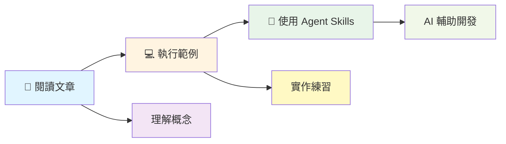
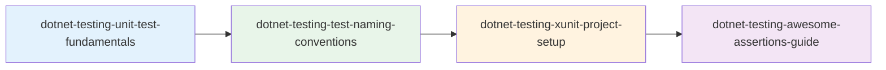
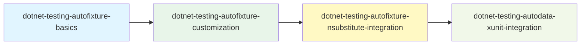
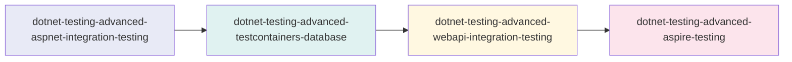

# .NET Testing Agent Skills

[](https://opensource.org/licenses/MIT)
[](https://dotnet.microsoft.com/)
[](https://xunit.net/)
[](https://xunit.net/)

> 🏆 基於 **2025 iThome 鐵人賽 Software Development 組冠軍作品**「老派軟體工程師的測試修練 - 30 天挑戰」提煉而成

專為 .NET 開發者打造的 AI Agent Skills 集合，涵蓋從單元測試到整合測試的完整最佳實踐。讓 GitHub Copilot、Claude 等 AI 助理自動為您提供專業的測試指導！

---

## ✨ 特色

- 🎯 **符合官方規範**：29 個 skills 的 description 包含 Keywords 關鍵字，AI 根據對話內容自動載入
- 📚 **29 個精煉技能**：包含 2 個總覽技能 + 27 個專業技能，涵蓋單元測試、模擬、測試資料生成、整合測試等
- 🔧 **即用範本**：提供完整的專案結構與程式碼範例
- 🌐 **多平台支援**：GitHub Copilot、Claude Code、Cursor 等
- 📖 **中文友善**：完整的繁體中文文件與命名建議
- 📦 **標準化結構**：符合 Claude Code skills 標準，支援 npx skills install 安裝
- 📊 **2026-02-01 全面優化**：Description（含 Keywords）、入口導航全面強化

---

## 🚀 快速開始

### 方法一：使用 npx skills install（推薦）

```bash
# 從 GitHub 直接安裝到 Claude Code 全域 skills
npx skills install https://github.com/kevintsengtw/dotnet-testing-agent-skills.git

# 或安裝到當前工作區
npx skills install https://github.com/kevintsengtw/dotnet-testing-agent-skills.git --workspace
```

### 方法二：直接複製

#### 複製到 GitHub Copilot（VS Code）

**Linux / macOS (Bash)**
```bash
# 1. Clone 此 repo
git clone https://github.com/kevintsengtw/dotnet-testing-agent-skills.git

# 2. 複製到您的專案（GitHub Copilot 使用 .github/skills）
cp -r dotnet-testing-agent-skills/skills /your-project/.github/

# 3. 在 VS Code 中啟用 Agent Skills
# 設定 → 搜尋 "chat.useAgentSkills" → 勾選啟用
```

**Windows (PowerShell)**
```powershell
# 1. Clone 此 repo
git clone https://github.com/kevintsengtw/dotnet-testing-agent-skills.git

# 2. 複製到您的專案（GitHub Copilot 使用 .github/skills）
Copy-Item -Path "dotnet-testing-agent-skills\skills" -Destination "\your-project\.github\" -Recurse

# 3. 在 VS Code 中啟用 Agent Skills
# 設定 → 搜尋 "chat.useAgentSkills" → 勾選啟用
```

#### 複製到 Claude Code

**Linux / macOS (Bash)**
```bash
# 複製到 Claude Code 工作區 skills
cp -r dotnet-testing-agent-skills/skills /your-project/.claude/

# 或複製到全域 skills
cp -r dotnet-testing-agent-skills/skills ~/.config/claude/
```

**Windows (PowerShell)**
```powershell
# 複製到 Claude Code 工作區 skills
Copy-Item -Path "dotnet-testing-agent-skills\skills" -Destination "\your-project\.claude\" -Recurse

# 或複製到全域 skills
Copy-Item -Path "dotnet-testing-agent-skills\skills" -Destination "$env:APPDATA\claude\" -Recurse
```

### 方法三：Git Submodule

```bash
cd /your-project

# 對 GitHub Copilot：加入 submodule 到 .github/skills
git submodule add https://github.com/kevintsengtw/dotnet-testing-agent-skills .github/skills
cd .github/skills && cp -r skills/* . && cd ../..

# 對 Claude Code：加入 submodule 到 .claude/skills
git submodule add https://github.com/kevintsengtw/dotnet-testing-agent-skills .claude/skills
cd .claude/skills && cp -r skills/* . && cd ../..
```

### 方法四：選擇性複製

只需要特定技能？

#### Linux / macOS (Bash)

```bash
# 只複製單元測試基礎
cp -r dotnet-testing-agent-skills/skills/dotnet-testing-unit-test-fundamentals /your-project/.github/skills/

# 只複製 AutoFixture 系列
cp -r dotnet-testing-agent-skills/skills/dotnet-testing-autofixture-* /your-project/.github/skills/

# 只複製總覽 skills
cp -r dotnet-testing-agent-skills/skills/dotnet-testing /your-project/.github/skills/
cp -r dotnet-testing-agent-skills/skills/dotnet-testing-advanced /your-project/.github/skills/
```

#### Windows (PowerShell)

```powershell
# 只複製單元測試基礎
Copy-Item -Path "dotnet-testing-agent-skills\skills\dotnet-testing-unit-test-fundamentals" -Destination "\your-project\.github\skills\" -Recurse

# 只複製 AutoFixture 系列
Get-ChildItem -Path "dotnet-testing-agent-skills\skills\dotnet-testing-autofixture-*" | Copy-Item -Destination "\your-project\.github\skills\" -Recurse

# 只複製總覽 skills
Copy-Item -Path "dotnet-testing-agent-skills\skills\dotnet-testing" -Destination "\your-project\.github\skills\" -Recurse
Copy-Item -Path "dotnet-testing-agent-skills\skills\dotnet-testing-advanced" -Destination "\your-project\.github\skills\" -Recurse
```

---

## 目錄結構

```text
skills/
├── dotnet-testing/                              # ⭐ 總覽：基礎技能導航（19 個子技能）
├── dotnet-testing-advanced/                     # ⭐ 總覽：進階技能導航（8 個子技能）
├── dotnet-testing-unit-test-fundamentals/
├── dotnet-testing-test-naming-conventions/
├── dotnet-testing-xunit-project-setup/
├── dotnet-testing-awesome-assertions-guide/
├── dotnet-testing-complex-object-comparison/
├── dotnet-testing-code-coverage-analysis/
├── dotnet-testing-nsubstitute-mocking/
├── dotnet-testing-test-output-logging/
├── dotnet-testing-private-internal-testing/
├── dotnet-testing-fluentvalidation-testing/
├── dotnet-testing-datetime-testing-timeprovider/
├── dotnet-testing-filesystem-testing-abstractions/
├── dotnet-testing-test-data-builder-pattern/
├── dotnet-testing-autofixture-basics/
├── dotnet-testing-autofixture-customization/
├── dotnet-testing-autodata-xunit-integration/
├── dotnet-testing-autofixture-nsubstitute-integration/
├── dotnet-testing-bogus-fake-data/
├── dotnet-testing-autofixture-bogus-integration/
├── dotnet-testing-advanced-aspnet-integration-testing/
├── dotnet-testing-advanced-testcontainers-database/
├── dotnet-testing-advanced-testcontainers-nosql/
├── dotnet-testing-advanced-webapi-integration-testing/
├── dotnet-testing-advanced-aspire-testing/
├── dotnet-testing-advanced-xunit-upgrade-guide/
├── dotnet-testing-advanced-tunit-fundamentals/
└── dotnet-testing-advanced-tunit-advanced/
```

> **注意**：
> - Skills 採用扁平結構，使用前綴命名來區分基礎技能 (`dotnet-testing-*`) 與進階技能 (`dotnet-testing-advanced-*`)
> - ⭐ 兩個總覽 skills 提供智能導航，自動推薦適合的子技能組合
> - 安裝後，skills 會根據目標環境複製到對應位置（`.github/skills/` 或 `.claude/skills/`）

---

## 📖 快速參考指南（推薦）

為了讓您快速上手並充分運用這些 skills，我們提供了完整的參考指南：

### `SKILLS_QUICK_REFERENCE.md` (v2.0.0 合併版)

**Skills 快速參考指南** - 整合 AI Agent 與開發者使用指引

**給 AI Agent 的指引**：
- 🔍 **關鍵字快速對應表**：20 個常用場景的關鍵字 → Skill 映射
- 🚀 **AI Agent 工作流程範本**：4 步驟自動化流程說明

**給開發者的參考**：
- 💬 **Prompt 模板**：3 種推薦的對話模板
- 🎯 **常見情境組合**：3 個完整的使用情境範例
- 📋 **完整技能目錄**：27 個 skills 分類清單
- 📊 **Skills 優化狀態**：Keywords 整合、預期效果說明

**使用方式**：
```bash
# 方法 1：複製為參考檔（推薦）
cp SKILLS_QUICK_REFERENCE.md /your-project/SKILLS_QUICK_REFERENCE.md

# 方法 2：整合到既有文件
# 如果專案已有類似的參考文件，建議手動將內容整合進去
```

**👉 為什麼需要這個指南？**

雖然總覽 skills (`dotnet-testing` 和 `dotnet-testing-advanced`) 提供智能導航，但快速參考指南能：

1. ✅ **快速查詢**：不確定用哪個 skill 時立即找到答案
2. ✅ **範例 Prompt**：提供可直接複製使用的對話範例
3. ✅ **情境組合**：展示實際的多 skill 搭配使用案例
4. ✅ **降低學習門檻**：不需記住所有 skill 名稱

---

## 技能清單

### 🎯 總覽技能 (2 個) - 新增！

> **NEW!** 兩個總覽 skills 提供智能導航，當您不確定使用哪個技能時，它們會自動分析需求並推薦適合的技能組合。

| 技能 | 說明 | 何時使用 |
|------|------|---------|
| `dotnet-testing` | 基礎測試技能總覽與引導中心 | 詢問「如何寫 .NET 測試」、「測試入門」等一般性問題時自動觸發 |
| `dotnet-testing-advanced` | 進階測試技能總覽與引導中心 | 詢問「整合測試」、「API 測試」、「微服務測試」等進階需求時自動觸發 |

**總覽 skills 的價值**：
- ✅ **智能推薦**：根據您的具體需求，推薦 1-4 個最適合的子技能組合
- ✅ **學習路徑**：提供循序漸進的學習建議（新手路徑、進階路徑）
- ✅ **決策支援**：透過決策樹快速找到需要的技能
- ✅ **範例導向**：每個任務都有完整的提示詞範例

### 基礎技能 (19 個)

<details>
<summary>第一階段：測試基礎與斷言 (10 個)</summary>

| 技能 | 說明 |
|------|------|
| `dotnet-testing-unit-test-fundamentals` | FIRST 原則、3A Pattern、測試金字塔 |
| `dotnet-testing-test-naming-conventions` | 三段式命名法、中文命名建議 |
| `dotnet-testing-xunit-project-setup` | xUnit 專案結構、配置、套件管理 |
| `dotnet-testing-awesome-assertions-guide` | FluentAssertions 流暢斷言 |
| `dotnet-testing-complex-object-comparison` | 深層物件比對技巧 |
| `dotnet-testing-code-coverage-analysis` | Coverlet 覆蓋率分析與報告 |
| `dotnet-testing-nsubstitute-mocking` | Mock/Stub/Spy 測試替身 |
| `dotnet-testing-test-output-logging` | ITestOutputHelper 與 ILogger 整合 |
| `dotnet-testing-private-internal-testing` | Private/Internal 成員測試策略 |
| `dotnet-testing-fluentvalidation-testing` | FluentValidation 驗證器測試 |

</details>

<details>
<summary>第二階段：可測試性抽象化 (2 個)</summary>

| 技能 | 說明 |
|------|------|
| `dotnet-testing-datetime-testing-timeprovider` | TimeProvider 時間抽象化 |
| `dotnet-testing-filesystem-testing-abstractions` | System.IO.Abstractions 檔案系統測試 |

</details>

<details>
<summary>第三階段：測試資料生成 (7 個)</summary>

| 技能 | 說明 |
|------|------|
| `dotnet-testing-test-data-builder-pattern` | 手動 Builder Pattern |
| `dotnet-testing-autofixture-basics` | AutoFixture 基礎與匿名測試資料 |
| `dotnet-testing-autofixture-customization` | AutoFixture 自訂化策略 |
| `dotnet-testing-autodata-xunit-integration` | AutoData 與 xUnit Theory 整合 |
| `dotnet-testing-autofixture-nsubstitute-integration` | AutoFixture + NSubstitute 自動模擬 |
| `dotnet-testing-bogus-fake-data` | Bogus 擬真資料產生 |
| `dotnet-testing-autofixture-bogus-integration` | AutoFixture 與 Bogus 整合 |

</details>

### 進階技能 (8 個)

<details>
<summary>第四階段：整合測試 (5 個)</summary>

| 技能 | 說明 |
|------|------|
| `dotnet-testing-advanced-aspnet-integration-testing` | WebApplicationFactory 整合測試 |
| `dotnet-testing-advanced-testcontainers-database` | PostgreSQL/MSSQL 容器化測試 |
| `dotnet-testing-advanced-testcontainers-nosql` | MongoDB/Redis 容器化測試 |
| `dotnet-testing-advanced-webapi-integration-testing` | WebAPI 完整整合測試流程 |
| `dotnet-testing-advanced-aspire-testing` | .NET Aspire Testing 框架 |

</details>

<details>
<summary>第五階段：框架遷移 (3 個)</summary>

| 技能 | 說明 |
|------|------|
| `dotnet-testing-advanced-xunit-upgrade-guide` | xUnit 2.9.x → 3.x 升級指南 |
| `dotnet-testing-advanced-tunit-fundamentals` | TUnit 新世代測試框架入門 |
| `dotnet-testing-advanced-tunit-advanced` | TUnit 進階應用 |

</details>

---

## 使用範例

設定完成後，您只需要自然地對話：

```text
👤：幫我建立一個 xUnit 測試專案

🤖：[自動載入 dotnet-testing-xunit-project-setup 技能]
    我將協助您建立標準的 xUnit 測試專案結構...
    
    1. 建立專案檔案
    2. 配置必要套件
    3. 設定測試執行環境
```

```text
👤：為這個 Service 寫單元測試，它有依賴需要 Mock

🤖：[自動載入 dotnet-testing-unit-test-fundamentals + dotnet-testing-nsubstitute-mocking 技能]
    根據測試最佳實踐，我將建立符合 3A Pattern 的測試...
```

更多使用情境請參考 [完整使用手冊](SKILLS_USAGE_GUIDE.md)。

---

## 學習資源

### 原始內容

這些 Agent Skills 是從以下內容提煉而成：

- 📖 **iThome 鐵人賽系列文章**：[老派軟體工程師的測試修練 - 30 天挑戰](https://ithelp.ithome.com.tw/users/20066083/ironman/8276)  
  🏆 2025 iThome 鐵人賽 Software Development 組冠軍
  
- 💻 **完整範例程式碼**：[30Days_in_Testing_Samples](https://github.com/kevintsengtw/30Days_in_Testing_Samples)  
  包含所有範例專案的可執行程式碼

### 深入學習文件

本專案提供五份完整的 Agent Skills 教學文件，幫助你深入理解如何打造專業的 AI 技能包：

- **[Agent Skills：從架構設計到實戰應用](docs/Agent_Skills_Mastery.pdf)**  
  完整涵蓋 Agent Skills 從理論到實踐的系統性教材。整合架構設計、模組化設計與實戰應用，提供從基礎概念到進階整合的完整學習路徑。

- **[Claude Code Skills: 讓 AI 變身專業工匠](docs/Agent_Skills_Architecture.pdf)**  
  深入解析 Agent Skills 的架構設計、運作原理與最佳實踐。從基礎概念到進階應用，完整說明如何將 AI 從通才訓練成專才。

- **[Agent Skills: 打造模組化 AI 專業技能包](docs/Agent_Skills_Modular_Mastery.pdf)**  
  詳細說明如何設計模組化的技能結構，包含 SKILL.md 撰寫規範、漸進式揭露機制、以及與其他客製化工具（Custom Instructions、MCP、Prompt Files）的比較與整合。

- **[Agent Skills 實戰: 打造 .NET 測試自動化專家](docs/Agent_Skills_.NET_Testing_Expert.pdf)**  
  從零開始的實作教學，一步步引導你建立第一個 Agent Skill。涵蓋完整的開發流程、觸發機制、以及如何在 VS Code 中成功啟用並測試你的技能。

- **[.NET Testing：寫得更好、跑得更快](docs/NET_Testing_Write_Better_Run_Faster.pdf)**  
  結合 NikiforovAll 的 `dotnet-test` skill，專注於測試執行優化與除錯。教你如何使用 Build-First 策略提升效能、透過精準過濾執行特定測試案例、以及運用 Blame Mode (`--blame-hang` / `--blame-crash`) 診斷測試卡死或崩潰問題。此技能可與 `kevintsengtw/dotnet-testing-agent-skills` 互補，前者專注於「如何執行測試」，後者專注於「如何撰寫測試」。  
  **相關資源**：[NikiforovAll dotnet-test skill](https://github.com/NikiforovAll/claude-code-rules/tree/main/plugins/handbook-dotnet/skills/dotnet-test) | [2 MUST USE features for dotnet test debugging](https://www.youtube.com/watch?v=JTmIO21KmGw)

### 30 天挑戰完整索引

<details>
<summary>📚 第一階段：測試基礎與斷言 (Day 01-09)</summary>

| Day | 主題 | 文章 | 範例 |
|-----|------|------|------|
| 01 | 老派工程師的測試啟蒙 - 為什麼我們需要測試？ | [連結](https://ithelp.ithome.com.tw/articles/10373888) | [day01/](https://github.com/kevintsengtw/30Days_in_Testing_Samples/tree/main/day01) |
| 02 | xUnit 框架深度解析 - 從生態概觀到實戰專案 | [連結](https://ithelp.ithome.com.tw/articles/10373952) | [day02/](https://github.com/kevintsengtw/30Days_in_Testing_Samples/tree/main/day02) |
| 03 | xUnit 進階功能與測試資料管理 | [連結](https://ithelp.ithome.com.tw/articles/10374064) | [day03/](https://github.com/kevintsengtw/30Days_in_Testing_Samples/tree/main/day03) |
| 04 | AwesomeAssertions 基礎應用與實戰技巧 | [連結](https://ithelp.ithome.com.tw/articles/10374188) | [day04/](https://github.com/kevintsengtw/30Days_in_Testing_Samples/tree/main/day04) |
| 05 | AwesomeAssertions 進階技巧與複雜情境應用 | [連結](https://ithelp.ithome.com.tw/articles/10374425) | [day05/](https://github.com/kevintsengtw/30Days_in_Testing_Samples/tree/main/day05) |
| 06 | Code Coverage 程式碼涵蓋範圍實戰指南 | [連結](https://ithelp.ithome.com.tw/articles/10374467) | - |
| 07 | 依賴替代入門 - 使用 NSubstitute | [連結](https://ithelp.ithome.com.tw/articles/10374593) | [day07/](https://github.com/kevintsengtw/30Days_in_Testing_Samples/tree/main/day07) |
| 08 | 測試輸出與記錄 - xUnit ITestOutputHelper 與 ILogger | [連結](https://ithelp.ithome.com.tw/articles/10374711) | [day08/](https://github.com/kevintsengtw/30Days_in_Testing_Samples/tree/main/day08) |
| 09 | 測試私有與內部成員 - Private 與 Internal 的測試策略 | [連結](https://ithelp.ithome.com.tw/articles/10374866) | [day09/](https://github.com/kevintsengtw/30Days_in_Testing_Samples/tree/main/day09) |

</details>

<details>
<summary>🔧 第二階段：測試資料生成 (Day 10-18)</summary>

| Day | 主題 | 文章 | 範例 |
|-----|------|------|------|
| 10 | AutoFixture 基礎：自動產生測試資料 | [連結](https://ithelp.ithome.com.tw/articles/10375018) | [day10/](https://github.com/kevintsengtw/30Days_in_Testing_Samples/tree/main/day10) |
| 11 | AutoFixture 進階：自訂化測試資料生成策略 | [連結](https://ithelp.ithome.com.tw/articles/10375153) | [day11/](https://github.com/kevintsengtw/30Days_in_Testing_Samples/tree/main/day11) |
| 12 | 結合 AutoData：xUnit 與 AutoFixture 的整合應用 | [連結](https://ithelp.ithome.com.tw/articles/10375296) | [day12/](https://github.com/kevintsengtw/30Days_in_Testing_Samples/tree/main/day12) |
| 13 | NSubstitute 與 AutoFixture 的整合應用 | [連結](https://ithelp.ithome.com.tw/articles/10375419) | [day13/](https://github.com/kevintsengtw/30Days_in_Testing_Samples/tree/main/day13) |
| 14 | Bogus 入門：與 AutoFixture 的差異比較 | [連結](https://ithelp.ithome.com.tw/articles/10375501) | [day14/](https://github.com/kevintsengtw/30Days_in_Testing_Samples/tree/main/day14) |
| 15 | AutoFixture 與 Bogus 的整合應用 | [連結](https://ithelp.ithome.com.tw/articles/10375620) | [day15/](https://github.com/kevintsengtw/30Days_in_Testing_Samples/tree/main/day15) |
| 16 | 測試日期與時間：Microsoft.Bcl.TimeProvider 取代 DateTime | [連結](https://ithelp.ithome.com.tw/articles/10375821) | [day16/](https://github.com/kevintsengtw/30Days_in_Testing_Samples/tree/main/day16) |
| 17 | 檔案與 IO 測試：使用 System.IO.Abstractions 模擬檔案系統 | [連結](https://ithelp.ithome.com.tw/articles/10375981) | [day17/](https://github.com/kevintsengtw/30Days_in_Testing_Samples/tree/main/day17) |
| 18 | 驗證測試：FluentValidation Test Extensions | [連結](https://ithelp.ithome.com.tw/articles/10376147) | [day18/](https://github.com/kevintsengtw/30Days_in_Testing_Samples/tree/main/day18) |

</details>

<details>
<summary>🔗 第三階段：整合測試 (Day 19-25)</summary>

| Day | 主題 | 文章 | 範例 |
|-----|------|------|------|
| 19 | 整合測試入門：基礎架構與應用場景 | [連結](https://ithelp.ithome.com.tw/articles/10376335) | [day19/](https://github.com/kevintsengtw/30Days_in_Testing_Samples/tree/main/day19) |
| 20 | Testcontainers 初探：使用 Docker 架設測試環境 | [連結](https://ithelp.ithome.com.tw/articles/10376401) | [day20/](https://github.com/kevintsengtw/30Days_in_Testing_Samples/tree/main/day20) |
| 21 | Testcontainers 整合測試：MSSQL + EF Core 以及 Dapper | [連結](https://ithelp.ithome.com.tw/articles/10376524) | [day21/](https://github.com/kevintsengtw/30Days_in_Testing_Samples/tree/main/day21) |
| 22 | Testcontainers 整合測試：MongoDB 及 Redis 基礎到進階 | [連結](https://ithelp.ithome.com.tw/articles/10376740) | [day22/](https://github.com/kevintsengtw/30Days_in_Testing_Samples/tree/main/day22) |
| 23 | 整合測試實戰：WebApi 服務的整合測試 | [連結](https://ithelp.ithome.com.tw/articles/10376873) | [day23/](https://github.com/kevintsengtw/30Days_in_Testing_Samples/tree/main/day23) |
| 24 | .NET Aspire Testing 入門基礎介紹 | [連結](https://ithelp.ithome.com.tw/articles/10377071) | [day24/](https://github.com/kevintsengtw/30Days_in_Testing_Samples/tree/main/day24) |
| 25 | .NET Aspire 整合測試實戰：從 Testcontainers 到 Aspire | [連結](https://ithelp.ithome.com.tw/articles/10377197) | [day25/](https://github.com/kevintsengtw/30Days_in_Testing_Samples/tree/main/day25) |

</details>

<details>
<summary>🚀 第四階段：框架遷移與進階應用 (Day 26-30)</summary>

| Day | 主題 | 文章 | 範例 |
|-----|------|------|------|
| 26 | xUnit 升級指南：從 2.9.x 到 3.x 的轉換 | [連結](https://ithelp.ithome.com.tw/articles/10377477) | [day26/](https://github.com/kevintsengtw/30Days_in_Testing_Samples/tree/main/day26) |
| 27 | GitHub Copilot 測試實戰：AI 輔助測試開發指南 | [連結](https://ithelp.ithome.com.tw/articles/10377577) | [day27/](https://github.com/kevintsengtw/30Days_in_Testing_Samples/tree/main/day27) |
| 28 | TUnit 入門 - 下世代 .NET 測試框架探索 | [連結](https://ithelp.ithome.com.tw/articles/10377828) | [day28/](https://github.com/kevintsengtw/30Days_in_Testing_Samples/tree/main/day28) |
| 29 | TUnit 進階應用：資料驅動測試與依賴注入深度實戰 | [連結](https://ithelp.ithome.com.tw/articles/10377970) | [day29/](https://github.com/kevintsengtw/30Days_in_Testing_Samples/tree/main/day29) |
| 30 | TUnit 進階應用 - 執行控制與測試品質和 ASP.NET Core 整合 | [連結](https://ithelp.ithome.com.tw/articles/10378176) | [day30/](https://github.com/kevintsengtw/30Days_in_Testing_Samples/tree/main/day30) |

</details>

### 學習路徑



---

## 環境需求

### 基礎技能

- .NET 8.0 SDK 或更新版本
- VS Code / Visual Studio / Rider
- GitHub Copilot 或其他支援 Agent Skills 的 AI 助理

### 進階技能（整合測試）

- Docker Desktop
- WSL2（Windows 環境）
- .NET Aspire Workload（用於 Aspire Testing）

---

## 支援的 AI 平台

| 平台 | 支援狀態 | 說明 |
|------|---------|------|
| GitHub Copilot (VS Code) | ✅ 完整支援 | 需啟用 Agent Mode |
| GitHub Copilot CLI | ✅ 完整支援 | - |
| Claude Code CLI | ✅ 完整支援 | 使用 `/plugin` 指令 |
| Cursor | ✅ 完整支援 | - |
| Claude.ai (Web) | ⚠️ 部分支援 | 需手動貼上技能內容 |

---

## 相關連結

- **完整使用手冊**：[SKILLS_USAGE_GUIDE.md](SKILLS_USAGE_GUIDE.md)
- **Agent Skills 標準**：[agentskills.io](https://agentskills.io)
- **GitHub Copilot Agent Skills 文件**：[官方說明](https://docs.github.com/copilot/using-github-copilot/using-github-copilot-agent-skills)

---

## 🛠️ 技能組合建議

### 新手入門



### 效率提升



### 整合測試



---

## 貢獻

歡迎提交 Issues 和 Pull Requests！

如果您發現技能內容有誤或想要新增新技能，請：
1. Fork 本專案
2. 建立您的 feature branch
3. 提交 Pull Request

---

## 授權

MIT License - 自由使用與修改

---

## 致謝

感謝所有在 iThome 鐵人賽期間給予支持與回饋的讀者們！

---

**作者**：Kevin Tseng  
**最後更新**：2026-01-27  
