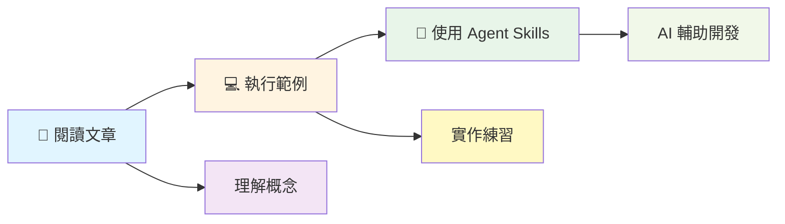
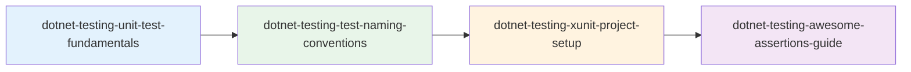
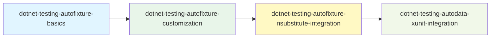
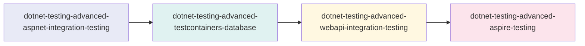

# .NET Testing Agent Skills

[](https://opensource.org/licenses/MIT)
[](https://dotnet.microsoft.com/)
[](https://xunit.net/)
[](https://xunit.net/)

> 🏆 基於 **2025 iThome 鐵人賽 Software Development 組冠軍作品**「老派軟體工程師的測試修練 - 30 天挑戰」提煉而成

專為 .NET 開發者打造的 AI Agent Skills 集合，涵蓋從單元測試到整合測試的完整最佳實踐。讓 GitHub Copilot、Claude 等 AI 助理自動為您提供專業的測試指導！

---

## ✨ 特色

- 🎯 **自動觸發**：AI 根據對話內容自動載入相關技能
- 📚 **27 個精煉技能**：涵蓋單元測試、模擬、測試資料生成、整合測試等
- 🔧 **即用範本**：提供完整的專案結構與程式碼範例
- 🌐 **多平台支援**：GitHub Copilot、Claude、Cursor 等
- 📖 **中文友善**：完整的繁體中文文件與命名建議

---

## 🚀 快速開始

### 方法一：直接複製（推薦）

#### Linux / macOS (Bash)

```bash
# 1. Clone 此 repo
git clone https://github.com/kevintsengtw/dotnet-testing-agent-skills.git

# 2. 複製到您的專案
cp -r dotnet-testing-agent-skills/.github/skills /your-project/.github/

# 3. 開始使用！在 VS Code 中啟用 Agent Skills
# 設定 → 搜尋 "chat.useAgentSkills" → 勾選啟用
```

#### Windows (PowerShell)

```powershell
# 1. Clone 此 repo
git clone https://github.com/kevintsengtw/dotnet-testing-agent-skills.git

# 2. 複製到您的專案
Copy-Item -Path "dotnet-testing-agent-skills\.github\skills" -Destination "\your-project\.github\" -Recurse

# 3. 開始使用！在 VS Code 中啟用 Agent Skills
# 設定 → 搜尋 "chat.useAgentSkills" → 勾選啟用
```

### 方法二：Git Submodule

```bash
cd /your-project

# 加入 submodule 到 skills 目錄
git submodule add https://github.com/kevintsengtw/dotnet-testing-agent-skills .github/skills

# 更新 submodule
git submodule update --init --recursive
```

> **注意**：使用 Submodule 方式時，Skills 會直接放在 `.github/skills/` 目錄下，無需建立符號連結。

### 方法三：選擇性複製

只需要特定技能？

#### Linux / macOS (Bash)

```bash
# 只複製單元測試基礎
cp -r dotnet-testing-agent-skills/.github/skills/dotnet-testing-unit-test-fundamentals /your-project/.github/skills/

# 只複製 AutoFixture 系列
cp -r dotnet-testing-agent-skills/.github/skills/dotnet-testing-autofixture-* /your-project/.github/skills/
```

#### Windows (PowerShell)

```powershell
# 只複製單元測試基礎
Copy-Item -Path "dotnet-testing-agent-skills\.github\skills\dotnet-testing-unit-test-fundamentals" -Destination "\your-project\.github\skills\" -Recurse

# 只複製 AutoFixture 系列
Get-ChildItem -Path "dotnet-testing-agent-skills\.github\skills\dotnet-testing-autofixture-*" | Copy-Item -Destination "\your-project\.github\skills\" -Recurse
```

---

## 目錄結構

```text
.github/skills/
├── dotnet-testing-unit-test-fundamentals/
├── dotnet-testing-test-naming-conventions/
├── dotnet-testing-xunit-project-setup/
├── dotnet-testing-awesome-assertions-guide/
├── dotnet-testing-complex-object-comparison/
├── dotnet-testing-code-coverage-analysis/
├── dotnet-testing-nsubstitute-mocking/
├── dotnet-testing-test-output-logging/
├── dotnet-testing-private-internal-testing/
├── dotnet-testing-fluentvalidation-testing/
├── dotnet-testing-datetime-testing-timeprovider/
├── dotnet-testing-filesystem-testing-abstractions/
├── dotnet-testing-test-data-builder-pattern/
├── dotnet-testing-autofixture-basics/
├── dotnet-testing-autofixture-customization/
├── dotnet-testing-autodata-xunit-integration/
├── dotnet-testing-autofixture-nsubstitute-integration/
├── dotnet-testing-bogus-fake-data/
├── dotnet-testing-autofixture-bogus-integration/
├── dotnet-testing-advanced-aspnet-integration-testing/
├── dotnet-testing-advanced-testcontainers-database/
├── dotnet-testing-advanced-testcontainers-nosql/
├── dotnet-testing-advanced-webapi-integration-testing/
├── dotnet-testing-advanced-aspire-testing/
├── dotnet-testing-advanced-xunit-upgrade-guide/
├── dotnet-testing-advanced-tunit-fundamentals/
└── dotnet-testing-advanced-tunit-advanced/
```

> **注意**：Skills 採用扁平結構，使用前綴命名來區分基礎技能 (`dotnet-testing-*`) 與進階技能 (`dotnet-testing-advanced-*`)。

---

## 🧑‍💻 輔助檔案（強烈建議）

為了讓 AI 更主動且準確地使用這些 skills，我們提供了兩個輔助檔案：

### 1️⃣ `.github/copilot-instructions.md` 

**GitHub Copilot 專案指示檔** - 讓 AI 自動識別正確的 skills

- 🎯 **自動識別**：GitHub Copilot 會自動讀取此檔，知道何時使用哪些 skills
- 📝 **6 大任務映射**：
  - 📦 建立測試專案
  - ✍️ 撰寫單元測試
  - 🎭 Mock 外部依賴
  - 🔧 產生測試資料
  - 🔗 整合測試
  - 📊 程式碼覆蓋率
- ⚡ **觸發關鍵字**：每個任務的常見語句清單
- 📦 **Skills 組合建議**：複雜任務的多 skill 搭配

**使用方式**：

<details>
<summary>📋 點擊查看完整內容（可直接複製到您的專案）</summary>

```markdown
# GitHub Copilot 專案指示

---

> 🎯 **適用範圍**：本指示專為使用 [kevintsengtw/dotnet-testing-agent-skills](https://github.com/kevintsengtw/dotnet-testing-agent-skills) 的專案設計
> 
> 📦 **Skills 來源**：基於「老派軟體工程師的測試修練 - 30 天挑戰」(2025 iThome 鐵人賽作品) 提煉的 27 個 .NET 測試技能

本專案是 .NET 測試相關的 Agent Skills 開發專案。

## Agent Skills 使用規則

當用戶請求與 .NET 測試相關的任務時，**請優先參考並明確載入對應的 Agent Skills**。

### 常見任務與 Skills 映射

#### 📦 建立測試專案

**觸發關鍵字**：「建立測試專案」、「設定測試環境」、「新增測試專案」

**必須使用的 Skills**：
- `dotnet-testing-xunit-project-setup` - 專案結構與設定
- `dotnet-testing-test-naming-conventions` - 命名規範

**參考流程**：
1. 使用 `dotnet-testing-xunit-project-setup` 建立專案結構
2. 配置 `.csproj` 檔案
3. 安裝必要 NuGet 套件
4. 設定 `xunit.runner.json`

---

#### ✍️ 撰寫單元測試

**觸發關鍵字**：「寫測試」、「為這個方法建立測試」、「單元測試」

**必須使用的 Skills**：
- `dotnet-testing-unit-test-fundamentals` - FIRST 原則與 3A Pattern
- `dotnet-testing-test-naming-conventions` - 測試命名
- `dotnet-testing-awesome-assertions-guide` - 斷言撰寫

**額外考量**：
- 如果有外部依賴 → 加入 `dotnet-testing-nsubstitute-mocking`
- 如果需要測試資料 → 加入 `dotnet-testing-autofixture-basics` 或 `dotnet-testing-bogus-fake-data`

---

#### 🎭 Mock 外部依賴

**觸發關鍵字**：「Mock」、「模擬」、「測試替身」、「有外部依賴」

**必須使用的 Skills**：
- `dotnet-testing-nsubstitute-mocking` - NSubstitute 使用方式

**進階組合**：
- 與 AutoFixture 整合 → `dotnet-testing-autofixture-nsubstitute-integration`

---

#### 🔧 產生測試資料

**觸發關鍵字**：「測試資料」、「假資料」、「產生資料」、「Builder Pattern」

**必須使用的 Skills**：
- 基礎：`dotnet-testing-autofixture-basics` 或 `dotnet-testing-bogus-fake-data`
- 自訂化：`dotnet-testing-autofixture-customization`
- xUnit 整合：`dotnet-testing-autodata-xunit-integration`
- 擬真資料：`dotnet-testing-bogus-fake-data`

---

#### 🔗 整合測試

**觸發關鍵字**：「整合測試」、「API 測試」、「資料庫測試」、「容器測試」

**必須使用的 Skills**：
- API 測試：`dotnet-testing-advanced-aspnet-integration-testing`
- 資料庫容器：`dotnet-testing-advanced-testcontainers-database`
- NoSQL 測試：`dotnet-testing-advanced-testcontainers-nosql`
- 完整流程：`dotnet-testing-advanced-webapi-integration-testing`

---

#### 📊 程式碼覆蓋率

**觸發關鍵字**：「覆蓋率」、「code coverage」、「測試覆蓋」

**必須使用的 Skills**：
- `dotnet-testing-code-coverage-analysis`

---

#### 🔄 框架升級/遷移

**觸發關鍵字**：「xUnit 升級」、「遷移到 TUnit」、「測試框架」

**必須使用的 Skills**：
- xUnit 升級：`dotnet-testing-advanced-xunit-upgrade-guide`
- TUnit 入門：`dotnet-testing-advanced-tunit-fundamentals`
- TUnit 進階：`dotnet-testing-advanced-tunit-advanced`

---

## 重要提醒

⚠️ **在回答任何 .NET 測試相關問題前**：

1. **先分析任務類型**：判斷屬於上述哪個類別
2. **明確載入 Skills**：在回應中說明「根據 XXX skill 的指導...」
3. **組合多個 Skills**：複雜任務可能需要多個 skills 搭配
4. **提供完整範例**：不要只給概念，要提供可執行的程式碼

---

## Skills 優先順序

當多個 skills 可能適用時：

1. **專案設定** → `dotnet-testing-xunit-project-setup`
2. **基礎測試** → `dotnet-testing-unit-test-fundamentals`
3. **命名規範** → `dotnet-testing-test-naming-conventions`
4. **依賴模擬** → `dotnet-testing-nsubstitute-mocking`
5. **測試資料** → `dotnet-testing-autofixture-basics`
6. **整合測試** → `dotnet-testing-advanced-*` 系列

---

## 最後更新

2026-01-23
```

</details>

⚠️ **重要**：
- 如果您的專案**已有** `.github/copilot-instructions.md`，請手動將上述內容**合併**到既有檔案中
- 如果您的專案**沒有** `.github/copilot-instructions.md`，可以直接複製上述內容建立新檔案

### 2️⃣ `SKILLS_QUICK_REFERENCE.md`

**Skills 快速參考指南** - 給開發者的速查手冊

- 📊 **快速查詢表**：任務 → Skills → 範例 Prompt
- 🎯 **情境組合**：3 個完整的實際使用情境
- 💬 **Prompt 模板**：可直接複製使用的對話範例
- 📚 **完整清單**：所有 27 個 skills 的索引

**使用方式**：
```bash
# 方法 1：複製為參考檔（推薦）
cp SKILLS_QUICK_REFERENCE.md /your-project/SKILLS_QUICK_REFERENCE.md

# 方法 2：整合到既有文件
# 如果專案已有類似的參考文件，建議手動將內容整合進去
```

**👉 為什麼需要這些檔案？**

Agent Skills 雖然強大，但 AI 不總是能主動識別何時使用。這兩個檔案能：

1. ✅ **提高 AI 主動性**：明確告訴 AI「應該」使用哪些 skills
2. ✅ **降低學習門檻**：用戶不需記住所有 skill 名稱
3. ✅ **確保品質一致**：每次都使用正確的 skills 組合
4. ✅ **加速開發**：提供現成的 prompt 範例

---

## 📁 目錄結構

## 技能清單

### 基礎技能 (19 個)

<details>
<summary>第一階段：測試基礎與斷言 (10 個)</summary>

| 技能 | 說明 |
|------|------|
| `dotnet-testing-unit-test-fundamentals` | FIRST 原則、3A Pattern、測試金字塔 |
| `dotnet-testing-test-naming-conventions` | 三段式命名法、中文命名建議 |
| `dotnet-testing-xunit-project-setup` | xUnit 專案結構、配置、套件管理 |
| `dotnet-testing-awesome-assertions-guide` | FluentAssertions 流暢斷言 |
| `dotnet-testing-complex-object-comparison` | 深層物件比對技巧 |
| `dotnet-testing-code-coverage-analysis` | Coverlet 覆蓋率分析與報告 |
| `dotnet-testing-nsubstitute-mocking` | Mock/Stub/Spy 測試替身 |
| `dotnet-testing-test-output-logging` | ITestOutputHelper 與 ILogger 整合 |
| `dotnet-testing-private-internal-testing` | Private/Internal 成員測試策略 |
| `dotnet-testing-fluentvalidation-testing` | FluentValidation 驗證器測試 |

</details>

<details>
<summary>第二階段：可測試性抽象化 (2 個)</summary>

| 技能 | 說明 |
|------|------|
| `dotnet-testing-datetime-testing-timeprovider` | TimeProvider 時間抽象化 |
| `dotnet-testing-filesystem-testing-abstractions` | System.IO.Abstractions 檔案系統測試 |

</details>

<details>
<summary>第三階段：測試資料生成 (7 個)</summary>

| 技能 | 說明 |
|------|------|
| `dotnet-testing-test-data-builder-pattern` | 手動 Builder Pattern |
| `dotnet-testing-autofixture-basics` | AutoFixture 基礎與匿名測試資料 |
| `dotnet-testing-autofixture-customization` | AutoFixture 自訂化策略 |
| `dotnet-testing-autodata-xunit-integration` | AutoData 與 xUnit Theory 整合 |
| `dotnet-testing-autofixture-nsubstitute-integration` | AutoFixture + NSubstitute 自動模擬 |
| `dotnet-testing-bogus-fake-data` | Bogus 擬真資料產生 |
| `dotnet-testing-autofixture-bogus-integration` | AutoFixture 與 Bogus 整合 |

</details>

### 進階技能 (8 個)

<details>
<summary>第四階段：整合測試 (5 個)</summary>

| 技能 | 說明 |
|------|------|
| `dotnet-testing-advanced-aspnet-integration-testing` | WebApplicationFactory 整合測試 |
| `dotnet-testing-advanced-testcontainers-database` | PostgreSQL/MSSQL 容器化測試 |
| `dotnet-testing-advanced-testcontainers-nosql` | MongoDB/Redis 容器化測試 |
| `dotnet-testing-advanced-webapi-integration-testing` | WebAPI 完整整合測試流程 |
| `dotnet-testing-advanced-aspire-testing` | .NET Aspire Testing 框架 |

</details>

<details>
<summary>第五階段：框架遷移 (3 個)</summary>

| 技能 | 說明 |
|------|------|
| `dotnet-testing-advanced-xunit-upgrade-guide` | xUnit 2.9.x → 3.x 升級指南 |
| `dotnet-testing-advanced-tunit-fundamentals` | TUnit 新世代測試框架入門 |
| `dotnet-testing-advanced-tunit-advanced` | TUnit 進階應用 |

</details>

---

## 使用範例

設定完成後，您只需要自然地對話：

```text
👤：幫我建立一個 xUnit 測試專案

🤖：[自動載入 dotnet-testing-xunit-project-setup 技能]
    我將協助您建立標準的 xUnit 測試專案結構...
    
    1. 建立專案檔案
    2. 配置必要套件
    3. 設定測試執行環境
```

```text
👤：為這個 Service 寫單元測試，它有依賴需要 Mock

🤖：[自動載入 dotnet-testing-unit-test-fundamentals + dotnet-testing-nsubstitute-mocking 技能]
    根據測試最佳實踐，我將建立符合 3A Pattern 的測試...
```

更多使用情境請參考 [完整使用手冊](SKILLS_USAGE_GUIDE.md)。

---

## 學習資源

### 原始內容

這些 Agent Skills 是從以下內容提煉而成：

- 📖 **iThome 鐵人賽系列文章**：[老派軟體工程師的測試修練 - 30 天挑戰](https://ithelp.ithome.com.tw/users/20066083/ironman/8276)  
  🏆 2025 iThome 鐵人賽 Software Development 組冠軍
  
- 💻 **完整範例程式碼**：[30Days_in_Testing_Samples](https://github.com/kevintsengtw/30Days_in_Testing_Samples)  
  包含所有範例專案的可執行程式碼

### 深入學習文件

本專案提供五份完整的 Agent Skills 教學文件，幫助你深入理解如何打造專業的 AI 技能包：

- **[Agent Skills：從架構設計到實戰應用](docs/Agent_Skills_Mastery.pdf)**  
  完整涵蓋 Agent Skills 從理論到實踐的系統性教材。整合架構設計、模組化設計與實戰應用，提供從基礎概念到進階整合的完整學習路徑。

- **[Claude Code Skills: 讓 AI 變身專業工匠](docs/Agent_Skills_Architecture.pdf)**  
  深入解析 Agent Skills 的架構設計、運作原理與最佳實踐。從基礎概念到進階應用，完整說明如何將 AI 從通才訓練成專才。

- **[Agent Skills: 打造模組化 AI 專業技能包](docs/Agent_Skills_Modular_Mastery.pdf)**  
  詳細說明如何設計模組化的技能結構，包含 SKILL.md 撰寫規範、漸進式揭露機制、以及與其他客製化工具（Custom Instructions、MCP、Prompt Files）的比較與整合。

- **[Agent Skills 實戰: 打造 .NET 測試自動化專家](docs/Agent_Skills_.NET_Testing_Expert.pdf)**  
  從零開始的實作教學，一步步引導你建立第一個 Agent Skill。涵蓋完整的開發流程、觸發機制、以及如何在 VS Code 中成功啟用並測試你的技能。

- **[.NET Testing：寫得更好、跑得更快](docs/NET_Testing_Write_Better_Run_Faster.pdf)**  
  結合 NikiforovAll 的 `dotnet-test` skill，專注於測試執行優化與除錯。教你如何使用 Build-First 策略提升效能、透過精準過濾執行特定測試案例、以及運用 Blame Mode (`--blame-hang` / `--blame-crash`) 診斷測試卡死或崩潰問題。此技能可與 `kevintsengtw/dotnet-testing-agent-skills` 互補，前者專注於「如何執行測試」，後者專注於「如何撰寫測試」。  
  **相關資源**：[NikiforovAll dotnet-test skill](https://github.com/NikiforovAll/claude-code-rules/tree/main/plugins/handbook-dotnet/skills/dotnet-test) | [2 MUST USE features for dotnet test debugging](https://www.youtube.com/watch?v=JTmIO21KmGw)

### 30 天挑戰完整索引

<details>
<summary>📚 第一階段：測試基礎與斷言 (Day 01-09)</summary>

| Day | 主題 | 文章 | 範例 |
|-----|------|------|------|
| 01 | 老派工程師的測試啟蒙 - 為什麼我們需要測試？ | [連結](https://ithelp.ithome.com.tw/articles/10373888) | [day01/](https://github.com/kevintsengtw/30Days_in_Testing_Samples/tree/main/day01) |
| 02 | xUnit 框架深度解析 - 從生態概觀到實戰專案 | [連結](https://ithelp.ithome.com.tw/articles/10373952) | [day02/](https://github.com/kevintsengtw/30Days_in_Testing_Samples/tree/main/day02) |
| 03 | xUnit 進階功能與測試資料管理 | [連結](https://ithelp.ithome.com.tw/articles/10374064) | [day03/](https://github.com/kevintsengtw/30Days_in_Testing_Samples/tree/main/day03) |
| 04 | AwesomeAssertions 基礎應用與實戰技巧 | [連結](https://ithelp.ithome.com.tw/articles/10374188) | [day04/](https://github.com/kevintsengtw/30Days_in_Testing_Samples/tree/main/day04) |
| 05 | AwesomeAssertions 進階技巧與複雜情境應用 | [連結](https://ithelp.ithome.com.tw/articles/10374425) | [day05/](https://github.com/kevintsengtw/30Days_in_Testing_Samples/tree/main/day05) |
| 06 | Code Coverage 程式碼涵蓋範圍實戰指南 | [連結](https://ithelp.ithome.com.tw/articles/10374467) | - |
| 07 | 依賴替代入門 - 使用 NSubstitute | [連結](https://ithelp.ithome.com.tw/articles/10374593) | [day07/](https://github.com/kevintsengtw/30Days_in_Testing_Samples/tree/main/day07) |
| 08 | 測試輸出與記錄 - xUnit ITestOutputHelper 與 ILogger | [連結](https://ithelp.ithome.com.tw/articles/10374711) | [day08/](https://github.com/kevintsengtw/30Days_in_Testing_Samples/tree/main/day08) |
| 09 | 測試私有與內部成員 - Private 與 Internal 的測試策略 | [連結](https://ithelp.ithome.com.tw/articles/10374866) | [day09/](https://github.com/kevintsengtw/30Days_in_Testing_Samples/tree/main/day09) |

</details>

<details>
<summary>🔧 第二階段：測試資料生成 (Day 10-18)</summary>

| Day | 主題 | 文章 | 範例 |
|-----|------|------|------|
| 10 | AutoFixture 基礎：自動產生測試資料 | [連結](https://ithelp.ithome.com.tw/articles/10375018) | [day10/](https://github.com/kevintsengtw/30Days_in_Testing_Samples/tree/main/day10) |
| 11 | AutoFixture 進階：自訂化測試資料生成策略 | [連結](https://ithelp.ithome.com.tw/articles/10375153) | [day11/](https://github.com/kevintsengtw/30Days_in_Testing_Samples/tree/main/day11) |
| 12 | 結合 AutoData：xUnit 與 AutoFixture 的整合應用 | [連結](https://ithelp.ithome.com.tw/articles/10375296) | [day12/](https://github.com/kevintsengtw/30Days_in_Testing_Samples/tree/main/day12) |
| 13 | NSubstitute 與 AutoFixture 的整合應用 | [連結](https://ithelp.ithome.com.tw/articles/10375419) | [day13/](https://github.com/kevintsengtw/30Days_in_Testing_Samples/tree/main/day13) |
| 14 | Bogus 入門：與 AutoFixture 的差異比較 | [連結](https://ithelp.ithome.com.tw/articles/10375501) | [day14/](https://github.com/kevintsengtw/30Days_in_Testing_Samples/tree/main/day14) |
| 15 | AutoFixture 與 Bogus 的整合應用 | [連結](https://ithelp.ithome.com.tw/articles/10375620) | [day15/](https://github.com/kevintsengtw/30Days_in_Testing_Samples/tree/main/day15) |
| 16 | 測試日期與時間：Microsoft.Bcl.TimeProvider 取代 DateTime | [連結](https://ithelp.ithome.com.tw/articles/10375821) | [day16/](https://github.com/kevintsengtw/30Days_in_Testing_Samples/tree/main/day16) |
| 17 | 檔案與 IO 測試：使用 System.IO.Abstractions 模擬檔案系統 | [連結](https://ithelp.ithome.com.tw/articles/10375981) | [day17/](https://github.com/kevintsengtw/30Days_in_Testing_Samples/tree/main/day17) |
| 18 | 驗證測試：FluentValidation Test Extensions | [連結](https://ithelp.ithome.com.tw/articles/10376147) | [day18/](https://github.com/kevintsengtw/30Days_in_Testing_Samples/tree/main/day18) |

</details>

<details>
<summary>🔗 第三階段：整合測試 (Day 19-25)</summary>

| Day | 主題 | 文章 | 範例 |
|-----|------|------|------|
| 19 | 整合測試入門：基礎架構與應用場景 | [連結](https://ithelp.ithome.com.tw/articles/10376335) | [day19/](https://github.com/kevintsengtw/30Days_in_Testing_Samples/tree/main/day19) |
| 20 | Testcontainers 初探：使用 Docker 架設測試環境 | [連結](https://ithelp.ithome.com.tw/articles/10376401) | [day20/](https://github.com/kevintsengtw/30Days_in_Testing_Samples/tree/main/day20) |
| 21 | Testcontainers 整合測試：MSSQL + EF Core 以及 Dapper | [連結](https://ithelp.ithome.com.tw/articles/10376524) | [day21/](https://github.com/kevintsengtw/30Days_in_Testing_Samples/tree/main/day21) |
| 22 | Testcontainers 整合測試：MongoDB 及 Redis 基礎到進階 | [連結](https://ithelp.ithome.com.tw/articles/10376740) | [day22/](https://github.com/kevintsengtw/30Days_in_Testing_Samples/tree/main/day22) |
| 23 | 整合測試實戰：WebApi 服務的整合測試 | [連結](https://ithelp.ithome.com.tw/articles/10376873) | [day23/](https://github.com/kevintsengtw/30Days_in_Testing_Samples/tree/main/day23) |
| 24 | .NET Aspire Testing 入門基礎介紹 | [連結](https://ithelp.ithome.com.tw/articles/10377071) | [day24/](https://github.com/kevintsengtw/30Days_in_Testing_Samples/tree/main/day24) |
| 25 | .NET Aspire 整合測試實戰：從 Testcontainers 到 Aspire | [連結](https://ithelp.ithome.com.tw/articles/10377197) | [day25/](https://github.com/kevintsengtw/30Days_in_Testing_Samples/tree/main/day25) |

</details>

<details>
<summary>🚀 第四階段：框架遷移與進階應用 (Day 26-30)</summary>

| Day | 主題 | 文章 | 範例 |
|-----|------|------|------|
| 26 | xUnit 升級指南：從 2.9.x 到 3.x 的轉換 | [連結](https://ithelp.ithome.com.tw/articles/10377477) | [day26/](https://github.com/kevintsengtw/30Days_in_Testing_Samples/tree/main/day26) |
| 27 | GitHub Copilot 測試實戰：AI 輔助測試開發指南 | [連結](https://ithelp.ithome.com.tw/articles/10377577) | [day27/](https://github.com/kevintsengtw/30Days_in_Testing_Samples/tree/main/day27) |
| 28 | TUnit 入門 - 下世代 .NET 測試框架探索 | [連結](https://ithelp.ithome.com.tw/articles/10377828) | [day28/](https://github.com/kevintsengtw/30Days_in_Testing_Samples/tree/main/day28) |
| 29 | TUnit 進階應用：資料驅動測試與依賴注入深度實戰 | [連結](https://ithelp.ithome.com.tw/articles/10377970) | [day29/](https://github.com/kevintsengtw/30Days_in_Testing_Samples/tree/main/day29) |
| 30 | TUnit 進階應用 - 執行控制與測試品質和 ASP.NET Core 整合 | [連結](https://ithelp.ithome.com.tw/articles/10378176) | [day30/](https://github.com/kevintsengtw/30Days_in_Testing_Samples/tree/main/day30) |

</details>

### 學習路徑



---

## 環境需求

### 基礎技能

- .NET 8.0 SDK 或更新版本
- VS Code / Visual Studio / Rider
- GitHub Copilot 或其他支援 Agent Skills 的 AI 助理

### 進階技能（整合測試）

- Docker Desktop
- WSL2（Windows 環境）
- .NET Aspire Workload（用於 Aspire Testing）

---

## 支援的 AI 平台

| 平台 | 支援狀態 | 說明 |
|------|---------|------|
| GitHub Copilot (VS Code) | ✅ 完整支援 | 需啟用 Agent Mode |
| GitHub Copilot CLI | ✅ 完整支援 | - |
| Claude Code CLI | ✅ 完整支援 | 使用 `/plugin` 指令 |
| Cursor | ✅ 完整支援 | - |
| Claude.ai (Web) | ⚠️ 部分支援 | 需手動貼上技能內容 |

---

## 相關連結

- **完整使用手冊**：[SKILLS_USAGE_GUIDE.md](SKILLS_USAGE_GUIDE.md)
- **Agent Skills 標準**：[agentskills.io](https://agentskills.io)
- **GitHub Copilot Agent Skills 文件**：[官方說明](https://docs.github.com/copilot/using-github-copilot/using-github-copilot-agent-skills)

---

## 🛠️ 技能組合建議

### 新手入門



### 效率提升



### 整合測試



---

## 貢獻

歡迎提交 Issues 和 Pull Requests！

如果您發現技能內容有誤或想要新增新技能，請：
1. Fork 本專案
2. 建立您的 feature branch
3. 提交 Pull Request

---

## 授權

MIT License - 自由使用與修改

---

## 致謝

感謝所有在 iThome 鐵人賽期間給予支持與回饋的讀者們！

---

**作者**：Kevin Tseng  
**最後更新**：2026-01-20  
